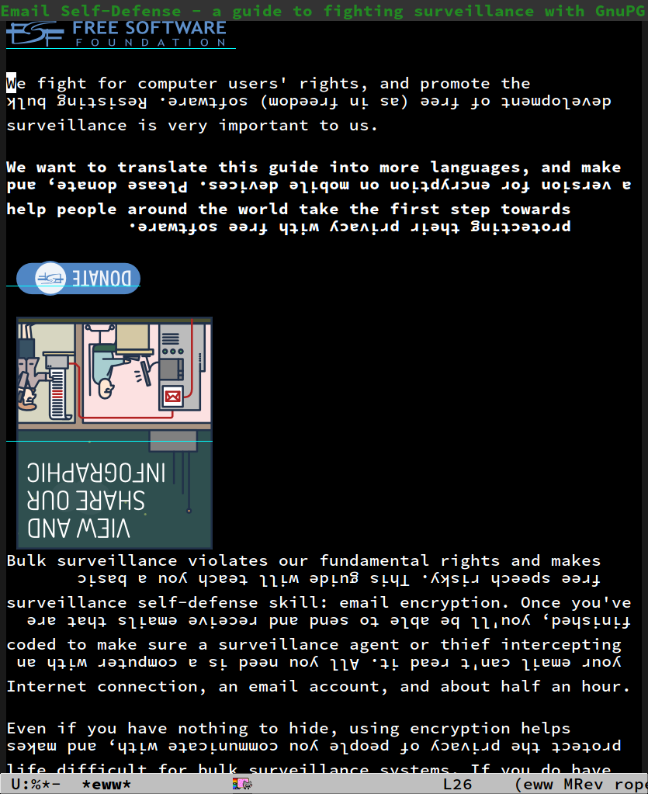

<h2>Table of Contents</h2>

<ul>
<li><a href="#orgheadline25">1. Commentary</a>
<ul>
<li><a href="#orgheadline4">1.1. What rope-read-mode is</a></li>
<li><a href="#orgheadline10">1.2. Usage</a></li>
<li><a href="#orgheadline13">1.3. Install</a></li>
<li><a href="#orgheadline14">1.4. Dependencies</a></li>
<li><a href="#orgheadline22">1.5. Development</a></li>
<li><a href="#orgheadline23">1.6. Links</a></li>
<li><a href="#orgheadline24">1.7. History</a></li>
</ul>
</li>
<li><a href="#orgheadline36">2. Code</a>
<ul>
<li><a href="#orgheadline26">2.1. Variables</a></li>
<li><a href="#orgheadline27">2.2. Keys</a></li>
<li><a href="#orgheadline28">2.3. Mode rope-read</a></li>
<li><a href="#orgheadline29">2.4. Management and Navigation</a></li>
<li><a href="#orgheadline32">2.5. Y-coordinates of a line</a></li>
<li><a href="#orgheadline33">2.6. Reverse every other line</a></li>
<li><a href="#orgheadline34">2.7. Snap the line which contains point</a></li>
<li><a href="#orgheadline35">2.8. Provide the file as library</a></li>
</ul>
</li>
</ul>

# Commentary

## What rope-read-mode is

`rope-read-mode` can reverse every other line of a buffer or in a part
of a buffer.  With every other line reversed reading is like following
a rope.

### Illustration

### Benefits

-   Chill.  `rope-read-mode` often allows fluent reading by finding the
    start of the next line easily.
-   Have an alternative view on text.

### Price

Typically you need to invest some time to learn to read upside-down
lines easily.

## Usage

### Turning it on and off

Type `M-x rope-read-mode` in a buffer to activate rope-read.  No
visible change is to be expected.

Type `M-x rope-read-mode` or press 'q' to quit rope-read.

Isn't this amazing?

### Action

When `rope-read-mode` is on you can press

-   `C-g` to interrupt any `rope-read-mode` performance,
-   `g` to get a view of the window (which is the currently
    visible part of the buffer) with every other line reversed,
-   `r` to go back to the representation of the buffer without
    reversed line,
-   `d` to reverse every other line starting with the line below
    the current cursor position,
-   `p` to reverse every other line starting with the line below the
    current cursor position up to the end of the paragraph if possible
    and move point there.
-   `SPC` to scroll a screen down,
-   `<backspace>` or `S-SPC` to scroll a screen up,
-   `v` or `<return>` to scroll one line down,
-   `V` or `y` to scroll one line up,
-   `?` to open the help buffer,
-   `q` to quit.

For convenience you can bind command `rope-read-mode` to a key.  For
example to activate or deactivate rope-read-mode by pressing scroll
lock two times use the line

    (global-set-key (kbd "<Scroll_Lock> <Scroll_Lock>") 'rope-read-mode)

### Image files

The reverse representation of lines is realized with images.  They get
collected in directory `rope-read-image-overlay-path`.  You can delete
this directory any time.

### Security

`rope-read-mode` does not change the content of a buffer.  In the
sense of data loss `rope-read-mode` looks save.

Note that the overlay-image files get stored on disk.  This could be a
security issue.

### Beep

The system beep can be annoying.  The line

    amixer set Beep off

silences the beep.  Precondition is that you have the `amixer` program
ready.

## Install

### Emacs Package

When installed as Emacs package
 then there is
no need of a special configuration.

### Install from el file

If you just have the emacs-lisp file then:

-   load the file into Emacs
-   do `M-x eval-buffer`

That's it.  You installed rope-read-mode and `M-x rope-read-mode` is
available.

## Dependencies

-   Emacs is running under X.
-   The programm `convert` of the ImageMagick-suite is available.

The `convert` program has the job to create images of lines and rotate
them.

## Development

### Known Bugs

-   rope-read-mode sometimes spontaneously fails.
    -   In this case a refresh with `g` might help.
    -   You can always try `C-g q` and start again.
-   rope-read-mode often does not work for org-mode files.
    -   Possibly this is due to the interference of overlays of org and
        rope-read.

### Wishes

-   Quicker transformation.

### Vision

rope-read-mode gets rope-mode which allows also editing.  rope-mode
would provide a further possibility for the user to use Emacs, just as
changing the default font.

### Lentic Literate Style

This program is written in emacs lisp in lentic style based on the
'lentic' package .

This means the that this file can be regarded just as an emacs lisp
file.  But actually this file contains extra comments which allow the
interpretation of the file as Org file.  Lentic-mode makes it easy to
write this style.

A possible initialization of lentic is this:

    (global-lentic-start-mode)

Find more about lentic at
.

### Communication

Use the GitHub infrastructure i.e. pull requests or
<https://github.com/marcowahl/rope-read-mode/issues>.  Or contact the
author directly.

### Contribution

Contributions in any respect are welcome, e.g. ideas and improvements.

### Contributors

<table border="2" cellspacing="0" cellpadding="6" rules="groups" frame="hsides">

<colgroup>
<col  class="org-left" />
</colgroup>
<tbody>
<tr>
<td class="org-left">Syohei YOSHIDA</td>
</tr>

<tr>
<td class="org-left">Marco WAHL</td>
</tr>
</tbody>
</table>

## Links

-   rope-read for firefox at
    <https://greasyfork.org/en/scripts/10634-rope-read>
-   'spray' which is available as Elpa package
     realizes another
    alternative view mode.
-   'fliptext' which also is available as Elpa package
     realizes an
    
    ˙ʇxǝʇ pǝddılɟ ɹoɟ poɥʇǝɯ-ʇnduı

## History

<table border="2" cellspacing="0" cellpadding="6" rules="groups" frame="hsides">

<colgroup>
<col  class="org-right" />

<col  class="org-left" />
</colgroup>
<tbody>
<tr>
<td class="org-right">201501151211</td>
<td class="org-left">v0.1 New option rope-read-calculate-exact-y-coordinates</td>
</tr>

<tr>
<td class="org-right">201501311657</td>
<td class="org-left">v0.2 Replace whenever a line is ready</td>
</tr>

<tr>
<td class="org-right">201503160841</td>
<td class="org-left">Dropped option heuristic y-coordinates calculation</td>
</tr>

<tr>
<td class="org-right">201503161010</td>
<td class="org-left">v0.3 Operations based on visual movement-commands</td>
</tr>

<tr>
<td class="org-right">201508081255</td>
<td class="org-left">v0.3.1 rope-read-mode starts line reversing at point</td>
</tr>

<tr>
<td class="org-right">201510202326</td>
<td class="org-left">v0.3.2 rope-read-mode does nothing at start</td>
</tr>

<tr>
<td class="org-right">201511182342</td>
<td class="org-left">Paragraph wise rope-read is useful.</td>
</tr>
</tbody>
</table>

# Code

## Variables

    (defvar rope-read-overlays nil
      "List of rope-read-overlays.")
    
    (defvar rope-read-olimid-next-unused 0
      "Overlay-image-id that has not been used yet.
    
      The program must reset this variable reasonably when an id gets
      used.")
    
    (defvar rope-read-image-overlay-path "~/.emacs.d/rope-reading/"
      "Path where the overlay images get stored.")
    
    (defvar rope-read-image-overlay-filename-format-string
      (concat (file-name-directory rope-read-image-overlay-path) "%d.png")
      "Template for the filenames to be written to disk.")
    
    (defvar rope-read-mode nil)
    (make-variable-buffer-local 'rope-read-mode)
    
    (defvar rope-read-old-buffer-read-only)
    (make-variable-buffer-local 'rope-read-old-buffer-read-only)

## Keys

    (defvar rope-read-mode-hook nil)
    
    (defvar rope-read-mode-map
      (let ((map (make-sparse-keymap)))
        (define-key map " " #'rope-read-next-page)
        (define-key map [?\S-\ ] #'rope-read-prev-page)
        (define-key map (kbd "<backspace>") #'rope-read-prev-page)
        (define-key map (kbd "<return>") #'rope-read-scroll-up-line)
        (define-key map "v" #'rope-read-scroll-up-line)
        (define-key map "y" #'rope-read-scroll-down-line)
        (define-key map "V" #'rope-read-scroll-down-line)
        (define-key map "g" #'rope-read-refresh)
        (define-key map "d" #'rope-read-reol)
        (define-key map "p" #'rope-read-next-paragraph)
        (define-key map "r" #'rope-read-delete-overlays)
        (define-key map "q" #'rope-read-quit)
        (define-key map "?" #'describe-mode)
        map)
      "Keymap for ‘rope-read-mode’.")

    (defvar rope-read-transform-fun
      ;; #'rope-read-reol-in-visible-buffer-part-with-images
      #'rope-read-reol
      "The function which transforms a screen for rope-reading.
    
    This indirection is for the comfort of any coder to try
    out something new.")

## Mode rope-read

    ;;;###autoload
    (define-minor-mode rope-read-mode
      "Rope Reading mode.
    
    In rope-read-mode every other line gets reversed.  rope-read-mode is a
    view only mode.
    
    \\{rope-read-mode-map}
    
    This mode can help to save eye movements.
    
    By reversing every other line the reader often just can dip the
    gaze at the end of a line to read on instead of doing the
    annoying search for the next line at the other side of the text."
      :lighter " rope-read" :keymap rope-read-mode-map
      (if rope-read-mode (rope-read-mode-enable) (rope-read-mode-disable)))
    
    (defun rope-read-mode-enable ()
      (unless (file-exists-p rope-read-image-overlay-path)
        (make-directory rope-read-image-overlay-path))
      (setq rope-read-old-buffer-read-only buffer-read-only
            buffer-read-only t)
      (run-hooks 'rope-read-mode-hook))
    
    (defun rope-read-mode-disable ()
      (rope-read-delete-overlays)
      (setq buffer-read-only rope-read-old-buffer-read-only))

## Management and Navigation

    (defun rope-read-delete-overlays ()
      "Delete all overlays currently used with the rope-read-feature."
      (interactive)
      (mapc #'delete-overlay rope-read-overlays)
      (setq rope-read-overlays nil))
    
    (defun rope-read-next-page ()
      (interactive)
      (rope-read-delete-overlays)
      (scroll-up-command)
      (redisplay t)
      (move-to-window-line 0)
      (funcall rope-read-transform-fun))
    
    (defun rope-read-prev-page ()
      (interactive)
      (rope-read-delete-overlays)
      (scroll-down-command)
      (redisplay t)
      (move-to-window-line 0)
      (funcall rope-read-transform-fun))
    
    (defun rope-read-scroll-line (n)
      "Scroll the buffer N lines and reverse every other visible line."
      (rope-read-delete-overlays)
      (scroll-up-line n)
      (redisplay t)
      (move-to-window-line 0)
      (funcall rope-read-transform-fun))
    
    (defun rope-read-scroll-up-line (n)
      "Scroll the buffer up N lines and reverse every other visible line.
    
      E.g.  for N = 1 the second-line becomes first."
      (interactive "p")
      (unless n (setq n 1))
      (rope-read-scroll-line n))
    
    (defun rope-read-scroll-down-line (n)
      "Scroll the buffer down N lines and reverse every other line.
    
      E.g.  for N = 1 the first-line becomes second."
      (interactive "p")
      (unless n (setq n 1))
      (rope-read-scroll-line (- n)))
    
    (defun rope-read-refresh ()
      "Refresh the rope-read-representation for the given window."
      (interactive)
      (rope-read-delete-overlays)
      (redisplay t)
      (move-to-window-line 0)
      (funcall rope-read-transform-fun))
    
    (defun rope-read-quit ()
      (interactive)
      (when rope-read-mode (rope-read-mode 'toggle)))

## Y-coordinates of a line

### Exact y-coordinate calculation of a line

This function calculates the y-coordinates straightforward.  This
function takes a lot of time.

    (defun rope-read-y-info-of-line ()
      "Return the top coordinate and the height of the line that contains `(point)'.
    This function typically takes a while."
      (let* ((beg (progn (beginning-of-visual-line) (point)))
             (posn-at-point
              (progn
                (posn-at-point (point))))
             (y-top (cdr (posn-x-y posn-at-point)))
             (height (cdr (nth 9 posn-at-point)))
             (end (progn (end-of-visual-line) (point))))
        (goto-char beg)
        (while (and (< (point) (point-max))
                    (progn (forward-char)
                           (< (point) end)))
          (setq
           posn-at-point (posn-at-point (point))
           height (max height (cdr (nth 9 posn-at-point)))
           y-top (min y-top (cdr (posn-x-y posn-at-point)))))
        (cons y-top height)))

### TODO Try to speed up the function

Try to answer first: Is the speed up possible?

## Reverse every other line

    (defun rope-read-reol-in-visible-buffer-part-with-images ()
      "Reverse every other line in the visible buffer part."
      (move-to-window-line 0)
      (rope-read-reol))

    (defun rope-read-advance-one-visual-line ()
      (beginning-of-visual-line 2))
    
    (defun rope-read-reol ()
      "Reverse every other line in the visible part starting with line after point."
      (interactive)
      (save-excursion
        (let ((point-at-start (point))
              (last-line
               (progn (move-to-window-line -1)
                      (point))))
          (goto-char point-at-start)
          (beginning-of-visual-line)
          (rope-read-advance-one-visual-line)
          (while (and (< (point) last-line) ; todo: handle case of last line
                      (< (save-excursion (end-of-visual-line) (point))
                         (point-max))) ; todo: try to handle also the very
                                            ; last line.  the last line is
                                            ; special because it is
                                            ; special for the
                                            ; beginning-of-visual-line
                                            ; command.  no further
                                            ; iteration!
            (rope-read-snap-visual-line-under-olimid-filename)
            (let* ((l-above (save-excursion (beginning-of-visual-line 0) (point)))
                   (l-beg   (save-excursion (beginning-of-visual-line) (point)))
                   (l-end   (save-excursion (end-of-visual-line) (point)))
                   (l-next  (save-excursion
                              (goto-char l-beg) (beginning-of-visual-line 2) (point)))
                                            ; try to use for identify truncation of the line
                   (olimid-current (1- rope-read-olimid-next-unused)))
              (push (make-overlay l-beg l-end) rope-read-overlays)
              (overlay-put
               (car rope-read-overlays) 'display
               (create-image
                (expand-file-name
                 (format 
                  rope-read-image-overlay-filename-format-string
                  olimid-current))
                nil nil
                :ascent 'center
                ;; TODO: try to refine.  hint: try
                ;; understand.  is this a font-dependent
                ;; thing?  e.g. :ascent 83 is possible.
                ;; there are further attributes...
                ))
              (when (= l-end l-next)
                (overlay-put (car rope-read-overlays) 'after-string "\n")
                ;; this newline makes the images appear in some cases.
                ;; todo: at least think about doing something similar in
                ;; the analog case of 'before'.
                )
              (goto-char l-next)
              (redisplay t)
              (rope-read-advance-one-visual-line))))))

## Snap the line which contains point

For testing: (local-set-key (kbd "<f8>")
'rope-read-snap-visual-line-under-olimid-filename)

    (defun rope-read-snap-visual-line-under-olimid-filename ()
      "Snapshot the visual line with `(point)' flipflopped.
    
    Also consider the line above the line containing `(point)'.  If
    the line above is longer then extend the snapshot to use the
    length of the line above.  This often eases continuation of
    reading for short lines.
    
    The file name for the snapshot contains the number
    `rope-read-olimid-next-unused' as index.  Use the source for all
    detail."
      (interactive "P")
      (save-excursion
        (let* ((beg (progn (beginning-of-visual-line) (point)))
               (end (progn (end-of-visual-line) (point)))
               (end-above (save-excursion (goto-char beg) (end-of-visual-line 0) (point)))
               (beg-next (progn  (goto-char beg) (beginning-of-visual-line 2) ))
               (width (if (or (= end beg-next) (= end-above beg))
                          (- (nth 2 (window-inside-pixel-edges))
                             (nth 0 (window-inside-pixel-edges)))
                        (- (max (car (posn-x-y (posn-at-point end)))
                                (car (posn-x-y (posn-at-point end-above))))
                           (car (posn-x-y (posn-at-point beg))))))
               (y-info-getter #'rope-read-y-info-of-line)
               (y-top-height (progn (goto-char beg)
                                    (funcall y-info-getter)))
               (y-pos-line (car y-top-height))
               (height (cdr y-top-height))
               (x-win-left (nth 0 (window-inside-pixel-edges)))
               (y-win-top (nth 1 (window-inside-pixel-edges)))
               (x-anchor (+ x-win-left))
               (y-anchor (+ y-win-top y-pos-line)))
          (call-process
           "convert" nil nil nil
           (format "x:%s[%dx%d+%d+%d]"
                   (frame-parameter nil 'window-id)
                   width height x-anchor y-anchor)
           "-flip"
           "-flop"
           (expand-file-name
            (format
             rope-read-image-overlay-filename-format-string
             ((lambda ()
                (1-
                 (setq
                  rope-read-olimid-next-unused
                  (1+ rope-read-olimid-next-unused)))))))))))

## Provide the file as library

    (provide 'rope-read-mode)
