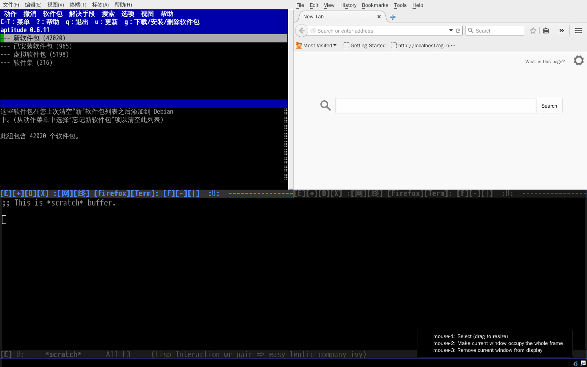
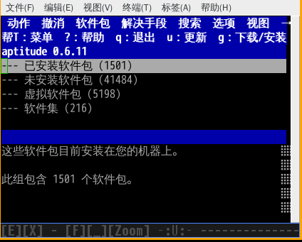

- [Exwm-X](#exwm-x)
  - [What is Exwm-X](#what-is-exwm-x)
  - [Feature](#feature)
  - [Pictures and videos](#pictures-and-videos)
  - [Install](#install)
  - [Configure](#configure)
    - [Edit "~/.initrc" file or "~/.xsession" file](#edit-"~/.initrc"-file-or-"~/.xsession"-file)
    - [Edit emacs configure](#edit-emacs-configure)

# Exwm-X

## What is Exwm-X

Exwm-X is an extension of exwm (emacs x window manager), which can
make exwm easier for Mouse-Control-People to use.

## Feature

1.  Shortcuts, toolbar and other window operate buttons in mode-line.
2.  Move or resize a floating-window without press WIN key.
3.  Jump-or-exec, which will switch to an exist app instead of launch it again.

## Pictures and videos

1.  Tilling windows

    

2.  Floating windows

    

3.  Exwm-X videos

    <https://github.com/tumashu/exwm-x-videos>

## Install

1.  Config melpa repository, please see：<http://melpa.org/#/getting-started>
2.  M-x package-install RET exwm-x RET

## Configure

### Edit "~/.initrc" file or "~/.xsession" file

You should edit "~/.initrc" file or "~/.xsession" file like below example:

    # The below line make sure "exwm-x-example" package correct loaded,
    # don't delete!
    export exwm_x_enable="yes"

    # Emacs X input method (exim) setting
    # export XMODIFIERS=@im=exim
    # export GTK_IM_MODULE=xim
    # export QT_IM_MODULE=xim
    # export CLUTTER_IM_MODULE=xim

    # xhost +

    exec dbus-launch --exit-with-session emacs

### Edit emacs configure

Add the below two lines to your emacs configure file:

    (require 'exwm-x)
    (require 'exwm-x-example) ;; Adjust this line.

Note: Package "exwm-x-example" is Exwm-X buildin example, user can use it to test Exwm-X's
features. If it doesn't suit for your need, just copy and paste its useful pieces
to your own exwm config :-)
