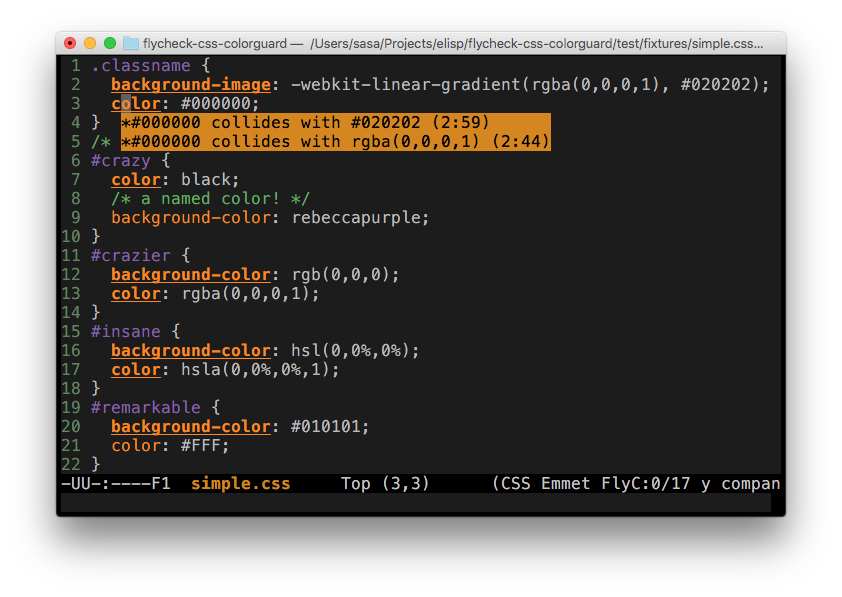

# flycheck-css-colorguard

[](https://github.com/Simplify/flycheck-css-colorguard/blob/master/COPYING)
[](http://melpa.org/#/flycheck-css-colorguard)

This is extension for [Flycheck](http://www.flycheck.org/).
It uses [CSS Colorguard](https://github.com/SlexAxton/css-colorguard) and
warns you when colors you've added are too similar to ones that already exist
in your css file.



## Installation

### Melpa

Package in available on [Melpa](https://melpa.org/).

#### `init.el`

```cl
(eval-after-load 'flycheck
   '(progn
      (require 'flycheck-css-colorguard)
      (flycheck-add-next-checker 'css-csslint
                                 'css-colorguard 'append)))
```

#### [Cask](http://cask.readthedocs.org)

```cl
(source gnu)
(source melpa)

(depends-on "flycheck-css-colorguard")
```

### Manual install

Untill Melpa is sorted out place flycheck-css-colorguard.el somewhere on your system and load it.
You'll need to have flycheck installed.

```cl
;; Replace ~/Projects/elisp/flycheck-css-colorguard/ with your location.
(add-to-list 'load-path "~/Projects/elisp/flycheck-css-colorguard/")
(load-library "flycheck-css-colorguard")
(eval-after-load 'flycheck
   '(progn
      (require 'flycheck-css-colorguard)
      (flycheck-add-next-checker 'css-csslint
                                 'css-colorguard 'append)))
```

## Usage

Just open any css file. If flycheck is properly configured, flycheck-css-colorguard will start automatically.

### CSS Colorguard installation

Make sure that you have CSS colorguard installed `npm install -g colorguard`.

**Use CSS Colorguard version 1.0.0 or higher!**
If you for some reason need to support CSS Colorguard older then 1.0.0, take oldest revision of
`flycheck-css-colorguard.el` and uncomment `:error-parser` and comment
`:error-patterns` code.

If you can't install CSS Colorguard globally or can't put executable in $PATH:

```cl
(custom-set-variables
 '(flycheck-css-colorguard-executable "~/my_executables/colorguard"))')
```

### CSS Colorguard options

CSS Colorguard supports only two options: `--treshold <value from 0 to 100>`
and `--options <your configuration in json file>`. You can set those in your `init.el`:

```cl
(custom-set-variables
 '(flycheck-css-colorguard-threshold "5"))
```

If you set `--options` config file, CSS Colorguard will ignore `--threshold`,
so there is no point for setting both of those.

```cl
(custom-set-variables
 '(flycheck-css-colorguard-config "config.json"))
```

## License

This program is free software: you can redistribute it and/or modify it under
the terms of the GNU General Public License as published by the Free Software
Foundation, either version 3 of the License, or (at your option) any later
version.

This program is distributed in the hope that it will be useful, but WITHOUT ANY
WARRANTY; without even the implied warranty of MERCHANTABILITY or FITNESS FOR A
PARTICULAR PURPOSE.  See the GNU General Public License for more details.

You should have received a copy of the GNU General Public License along with
this program.  If not, see http://www.gnu.org/licenses/.
