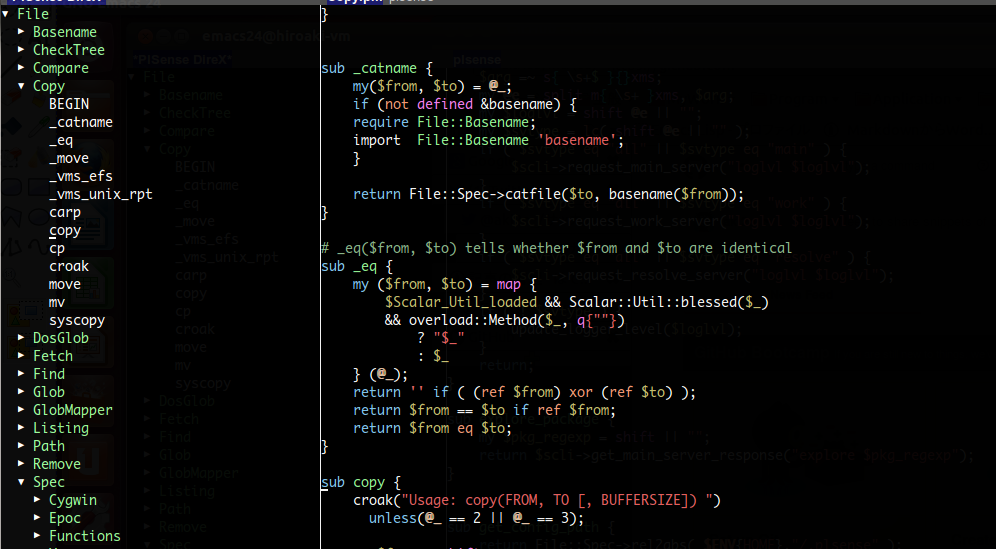
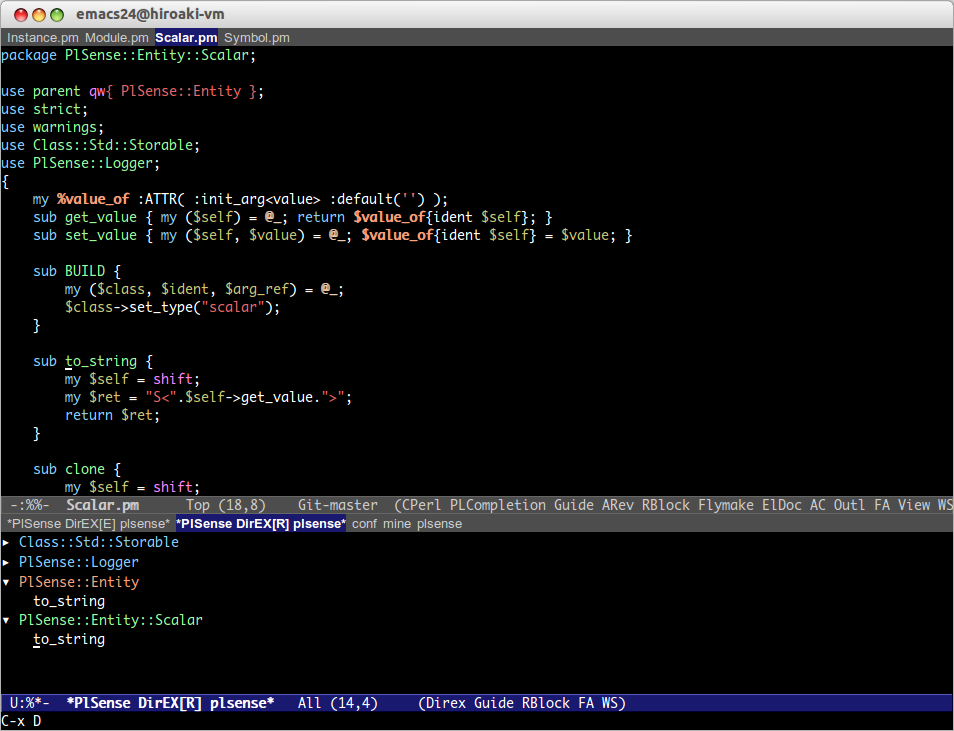

# これは何？

Perlのパッケージ構造を表示/移動することができるEmacsの拡張です。  
direx.elと同じように操作できます。  

direx.elについては、<https://github.com/m2ym/direx-el>





# 特徴

### ヘルプ表示

パッケージやメソッドにポイントしている状態で、"?"を押すとヘルプが表示されます。  

# Emacs以外に必要なもの

-   Unixシェル (Windowsの場合は、Cygwinなど)
-   Perl実行環境
-   

# インストール

### package.elを使う場合

2014/03/02 melpaリポジトリからインストール可能

### el-get.elを使う場合

2014/03/03 利用可能。ただし、masterブランチのみです。

### auto-install.elを使う場合

```lisp
(auto-install-from-url "https://raw.github.com/aki2o/plsense-direx/master/plsense-direx.el")
```
-   下記の依存拡張もそれぞれインストールする必要があります

### 手動の場合

plsense-direx.elをダウンロードし、load-pathの通った場所に配置して下さい。
-   下記の依存拡張もそれぞれインストールする必要があります

### 依存拡張

-   
-   
-   
-   

# 設定

```lisp
(require 'plsense-direx)

;; キーバインド
(setq plsense-direx:open-explorer-key "C-x j")
(setq plsense-direx:open-explorer-other-window-key "C-x J")
(setq plsense-direx:open-referer-key "C-x M-j")
(setq plsense-direx:open-referer-other-window-key "C-x C-M-J")

;; セットアップ実行
(plsense-direx:config-default)
```

# 留意事項

### パフォーマンス

2014/02/22現在、パフォーマンスが悪いです。  
それを軽減する  を作成しましたが、取り込まれない等でこの問題が改善されない場合、
 を使うことで改善することができます。  

2014/04/11 この問題は解消しました。  

# 動作確認

-   Emacs &#x2026; GNU Emacs 24.3.1 (i686-pc-linux-gnu, GTK+ Version 3.4.2) of 2013-08-22 on chindi02, modified by Debian
-   direx.el &#x2026; 0.1alpha
-   plsense.el &#x2026; 0.3.2
-   log4e.el &#x2026; 0.2.0
-   yaxception.el &#x2026; 0.3.2

**Enjoy!!!**
